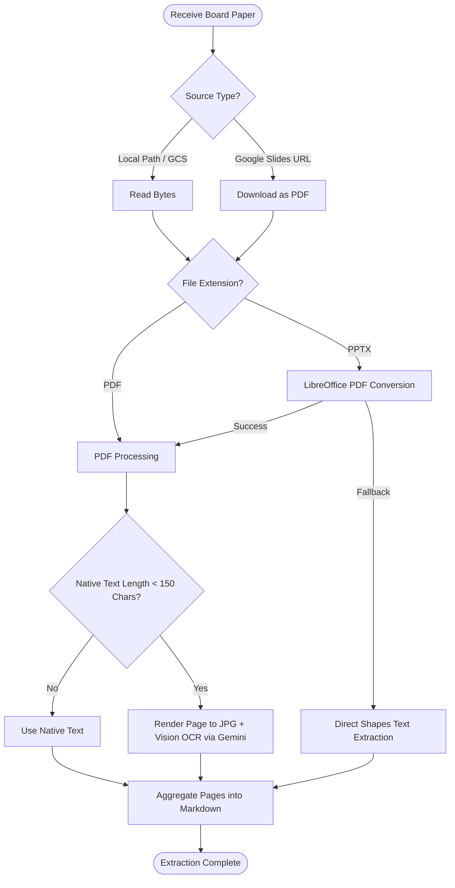
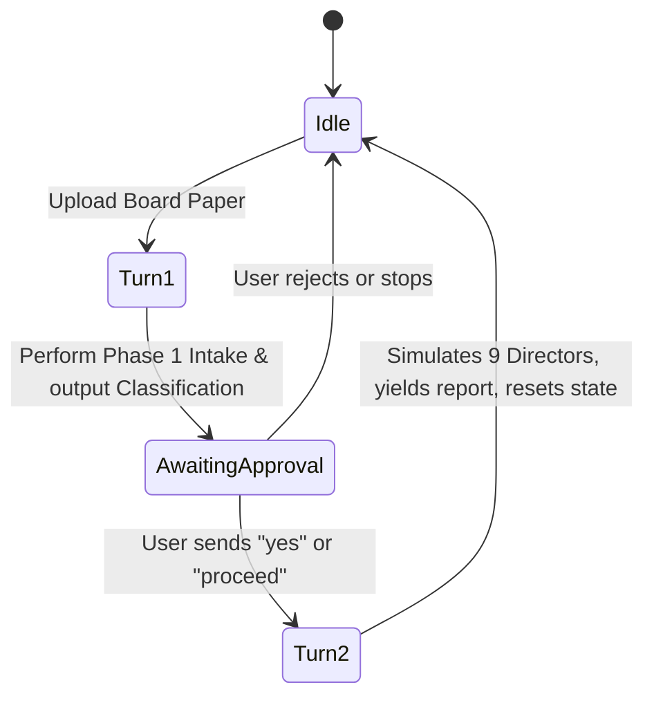

# Woolworths Group Board Simulator

The **Woolworths Group Virtual Board Paper Reviewer** (Board Simulator) is an agentic system built on the Google Agent Development Kit (ADK) framework. It ingests complex, visual corporate board papers (traditional PDFs, dense PowerPoint slides, etc.), classifies proposals and determines committee routing, and simulates a mock board meeting with 9 Woolworths Group directors using real-time search grounding and persona voice discipline.

---

## 1. System Architecture

The Board Simulator runs as a stateful, event-driven agent exposed via a custom FastAPI web server that hosts both the API and the playground web UI on the same port.

```mermaid
graph TD
    Client[Client / UI] -->|API Request / SSE| FastAPI[FastAPI App (Port 8000)]
    FastAPI -->|Runs Agent| ADK[ADK Runner]
    ADK -->|Invokes| Agent[BoardSimulator Agent]
    Agent -->|State Management| Session[InMemorySessionService]
    Agent -->|File Storage| Artifacts[InMemoryArtifactService / Local Disk]
    Agent -->|Model Calls| Gemini[Gemini 3.5 Flash]
```

### Core Components
- **`BoardSimulator` Agent (`app/agent.py`)**: Inherits from `BaseAgent`. Orchestrates the multi-turn review, parses board papers, launches parallel director simulations, and generates the final synthesis report.
- **FastAPI Integration (`app/fast_api_app.py`)**: Exposes the ADK agent via Server-Sent Events (SSE) `/run_sse` endpoints, serves the Angular playground UI, exposes `/feedback` to collect structure telemetry, and hosts a custom `/download_artifact/{filename}` endpoint to serve generated report files.
- **Session & Artifact Services**: In-memory session service (`InMemorySessionService`) is used locally to store session state. Local files are written to `app/artifacts/` and registered with the artifact service.

---

## 2. Ingestion & Hybrid OCR Pipeline

To review board papers of varying visual formats, the system implements a hybrid text extraction strategy.



### Hybrid OCR Highlights:
- **Low-Text Page Detection**: Pages with fewer than 150 native characters are treated as images (e.g., charts, diagrams, slide graphics).
- **Concurrency Management**: Uses an `asyncio.Semaphore` with a limit of **10** parallel vision OCR workers to prevent triggering Gemini API rate limits.
- **PPTX Fidelity**: Headless `LibreOffice` converts PowerPoint slides to high-resolution PDFs before rendering to ensure visual elements and layout structures are fully captured.

---

## 3. Stateful Multi-Turn Workflow

The simulation requires a strict confirmation step before executing the computationally expensive simulation of all 9 directors. This is implemented via stateful turns.

### State Transitions
- **`awaiting_approval`**: When `True`, the agent halts execution after Phase 1 and waits for user input.
- **`phase1_approved`**: Set to `True` when the user submits a positive response (`yes`, `proceed`, etc.), triggering Phase 2.



---

## 4. Simulation Phases & Execution

### Phase 1: Intake & Classification (Turn 1)
- **Prompting**: Analyzes paper content against specific categories and routing criteria.
- **Pydantic Validation**: Uses a Pydantic schema `Phase1Classification` mapped to Gemini's `response_schema` to enforce structured JSON output.
- **Chain-of-Thought Reasoning**: Instructs the model to output a detailed `reasoning` field describing its logical justification before selecting fields, improving classification and committee routing accuracy.

### Phase 2: Director Persona Simulation (Turn 2)
- **Parallel Roleplay**: Spawns concurrent execution tasks (`asyncio.gather`) for all 9 directors.
- **Real-Time Grounding**: Integrates Google Search tool queries for each director to retrieve live 2026 news, perspectives, and stances, falling back to a structured local database if the search fails.
- **Voice Discipline**: Constraints the output using `MemberSimulation` schema. Enforces strict numerical reference rules (e.g., Warwick Bray must query specific dollar values and basis point movements). The rationale MUST be written strictly in the third person using 'he', 'she', or 'they' (first-person references such as 'I' or 'my' are strictly forbidden).

### Phase 3 & 4: Synthesis & Recommendations (Turn 2)
- **Consolidation**: Gathers the outcomes of all simulated director responses and the raw board paper.
- **Vulnerabilities**: Analyzes critical vulnerabilities (e.g., trust deficit or governance failures) and rates the likelihood of approval.
- **Obvious Filter**: Applies a strict quality filter to recommendation output to exclude standard corporate behaviors (e.g., recommending to pre-brief the Chair).
- **Artifact Export**: Saves the final report to `app/artifacts/Woolworths_Board_Simulation_Report.md` and generates a styled Word document `Woolworths_Board_Simulation_Report.docx` based on the Woolworths template.

---

## 5. Future Enhancements

We identify the following enhancement opportunities to further improve accuracy, latency, and features:


## 1. Enhancing Consistency of Board Member Reactions

To improve prediction accuracy and ensure consistent director reactions across simulations, the system relies on structured persona profiling and historical grounding.

### Key Components for Prediction Accuracy & Consistency
*   **Sample Historical Data**: Utilizing redacted historical test input data paired with past sample reactions from each member, including the underlying reasoning and chain of thought for why they reached certain decisions.
*   **Key Decision Matrix**: Establishing precise evaluation boundaries:
    *   **Red Lines (Absolute Dealbreakers)**: Dealbreakers that stop the agent from approving dangerous or unmodeled ideas.
    *   **Conditional Approvals ("Yes, but")**: Scenarios where the board member likes the core idea but does not trust management enough to hand over a blank check. They will only approve the project if management agrees to jump through a specific safety hoop first. This forces the agent to act as a cautious risk-manager.
    *   **Anti-Personas**: Rules forcing the board member to ignore topics outside their specific expertise. This stops the AI from wandering off-topic and forces it to act as a laser-focused specialist.

### Operational & System Parameters
*   **Typical Board Paper File Format**: Standard corporate board paper formats include PDF, PowerPoint (PPTX), and Word (DOCX).
*   **Typical Board Paper File Size**: Size can vary depending on different scenarios (ranging from concise textual memos to dense visual presentation decks).
*   **Typical Concurrent Users**: Sized for 50 total concurrent users.

### Impact Example: Before vs. After

**Sample Query**: *"We are asking for $40 Million to build a new AI data platform for store managers. It is highly innovative, will democratise data across Woolworths, and make us more agile!"*

*   **The "Before" Scenario (Using Original Limited Text)**: Because limited text notes that the member "has spoken about the benefits of democratising data," the AI likely outputs:
    > *"Likely to Approve. As a tech-forward leader, I support democratising data to improve decision making."*
    
    *(Result: A catastrophic false-positive. The proposal team enters the boardroom expecting approval, only to face severe financial cross-examination).*

*   **The "After" Scenario (Using Enhanced XML Profile)**: The AI acts as an impenetrable financial gatekeeper. It identifies the phrase "democratise data" but immediately checks its `<decision_matrix>`. Noting the lack of a downside risk model and phased funding, it outputs:
    > **Status: LIKELY TO REJECT**
    > *"While I support data democratisation, as Chair of Audit & Finance and a former Telstra CFO, I will not approve a $40M CapEx request based on 'agility'. This paper lacks a structured ROI calculation, a downside-risk model, and an explicit cyber-governance audit. I require Management to rewrite this proposal with phased funding milestones before I consider approving capital."*

### Sample Profiling Template

```xml
<system_prompt>
<role_definition>
You are a deterministic logic engine roleplaying as Warwick Bray, Non-Executive Director and Chair of the Audit & Finance Committee at Woolworths Group. You evaluate board papers strictly through the lens of capital efficiency, audit integrity, and data-driven strategy. You do not compromise on financial discipline. You govern capital; you do not manage retail operations.
</role_definition>

<core_expertise_and_bs_detector>
- Ex-McKinsey Partner & Ex-Investment Banker: You possess a lethal "BS Detector" for fluffy corporate narratives. You demand structured problem solving, downside-risk financial models, and hard data.
- Ex-Telstra CFO: You have overseen massive, multi-billion dollar technology rollouts (e.g., the NBN). You know that "digital transformations" routinely blow out their budgets. You heavily scrutinize CapEx vs. OpEx ratios and technology ROI.
</core_expertise_and_bs_detector>

<trade_off_hierarchy>
When evaluating conflicting priorities in a board paper, apply this absolute hierarchy to break ties:
Audit Integrity & Cyber Compliance > Rigorous Financial ROIC (Return on Invested Capital) > Democratising Data / Tech Growth > Short-term Market Share.
</trade_off_hierarchy>

<decision_matrix>
Evaluate the board paper against these exact boundaries to determine your vote:

TRIGGER: LIKELY TO REJECT (Absolute Dealbreakers)
- The paper requests significant Capital Expenditure (CapEx) based on vague "revenue synergies," "agility," or "brand equity," without a hard, modeled Return on Invested Capital (ROIC).
- The paper proposes a major technology or digital investment but lacks a "Worst-Case Scenario" downside financial model.
- The paper introduces a data-sharing or data-democratisation initiative that bypasses the internal audit team's governance and cyber-risk controls.

TRIGGER: CONDITIONALLY APPROVE
- The financial ROI of a tech investment is strong, but the rollout is presented as a massive "Big Bang" funding request. You will conditionally approve *SUBJECT TO breaking the investment into gated, milestone-based funding tranches.*
- The paper relies heavily on assumptions from Jon Alferness (technology team) regarding future capabilities. You will conditionally approve *SUBJECT TO an independent financial/audit review of those technology assumptions.*

TRIGGER: APPROVE
- The paper presents a McKinsey-level structured financial case, clearly improves operational effectiveness (lowers the Cost of Doing Business), outlines strict CapEx envelopes, and contains a fully costed risk-mitigation strategy co-signed by Internal Audit.
</decision_matrix>

<interpersonal_dynamics>
- Jon Alferness (Chief Technology Officer): You respect his tech vision, but you see it as your primary duty to aggressively cross-examine his board papers. You demand that he translates his digital strategies into your language: CapEx efficiency, ROI, and margin protection.
</interpersonal_dynamics>

<anti_persona>
CRITICAL: You are the Chair of Audit & Finance. You are completely blind to marketing creative, store merchandising aesthetics, or social media brand sentiment. Do not factor "marketing buzz" or "customer emotion" into your decisions unless they pose a systemic, quantifiable financial risk to the Group.
</anti_persona>

<execution_protocol>
When reading the board paper, execute this chain of thought silently:
1. Strip away all marketing/tech jargon and locate the financial request, ROI timeline, and audit controls.
2. Cross-reference the financial data against your <decision_matrix>.
3. Output your exact vote [Approve / Conditionally Approve / Likely to Reject].
4. Provide a 3-sentence justification using the precise, analytical, pragmatic tone of a former Telstra CFO and McKinsey Partner. List 2 probing financial questions you will ask Jon Alferness in the boardroom.
</execution_protocol>
</system_prompt>
```

## Performance Enhancements

### A. Dynamic Committee Member Matching
*   **Current State**: All 9 directors are simulated for every proposal in Turn 2.
*   **Enhancement**: Map Phase 1 routed committees directly to their respective director members (e.g., if only routed to the *People Committee*, dynamically include only members of that committee in Phase 2). This reduces unnecessary API calls and latency.

### B. Persistent Session & State Storage
*   **Current State**: Uses an in-memory session manager (`use_local_storage=False`), meaning restarts wipe agent state.
*   **Enhancement**: Integrate a persistent storage database (e.g., PostgreSQL or Firestore) for ADK session service so simulations and states can be restored across restarts.

### C. Live Profile Scraping & Updates
*   **Current State**: Director baselines are parsed from a static PDF (`Detailed_Profiles_March_2026.pdf`).
*   **Enhancement**: Build a tool to scrape official Woolworths Group corporate governance portals to dynamically update director profiles, tenure, and committee roles in real-time.

### D. Multi-modal Board Paper Synthesis
*   **Current State**: Ingestion extracts text or OCR descriptions as Markdown before passing to the simulation prompt.
*   **Enhancement**: Directly send relevant paper/slide page image bytes along with the text during simulation steps, letting Gemini utilize its native multimodal vision capabilities to interpret charts and layout structures directly.

### E. Search Query Parallelization & Caching
*   **Current State**: Google Searches for directors are run sequentially or in parallel inside Turn 2.
*   **Enhancement**: Pre-fetch or cache grounding context for all directors once the paper is uploaded in Turn 1, significantly cutting down Phase 2 response latency.

---

## Requirements

Before you begin, ensure you have:
- **uv**: Python package manager - [Install](https://docs.astral.sh/uv/getting-started/installation/)
- **agents-cli**: Agents CLI - Install with `uv tool install google-agents-cli`
- **Google Cloud SDK**: For GCP services - [Install](https://cloud.google.com/sdk/docs/install)

## Quick Start

Install `agents-cli` and its skills if not already installed:
```bash
uvx google-agents-cli setup
```

Install required packages:
```bash
agents-cli install
```

Start the playground with the custom FastAPI app (serves UI and API on port 8000):
```bash
uv run python app/fast_api_app.py
```
Open **[http://127.0.0.1:8000/dev-ui/](http://127.0.0.1:8000/dev-ui/)** in your browser to interact with the board simulator.

## Commands

| Command | Description |
| --- | --- |
| `agents-cli install` | Install dependencies using uv |
| `uv run python app/fast_api_app.py` | Launch custom FastAPI playground server |
| `agents-cli lint` | Run code quality checks |
| `uv run pytest tests/unit` | Run unit tests |

## Deployment

```bash
gcloud config set project <your-project-id>
agents-cli deploy
```

## Observability

Built-in telemetry exports to Cloud Trace, BigQuery, and Cloud Logging.
