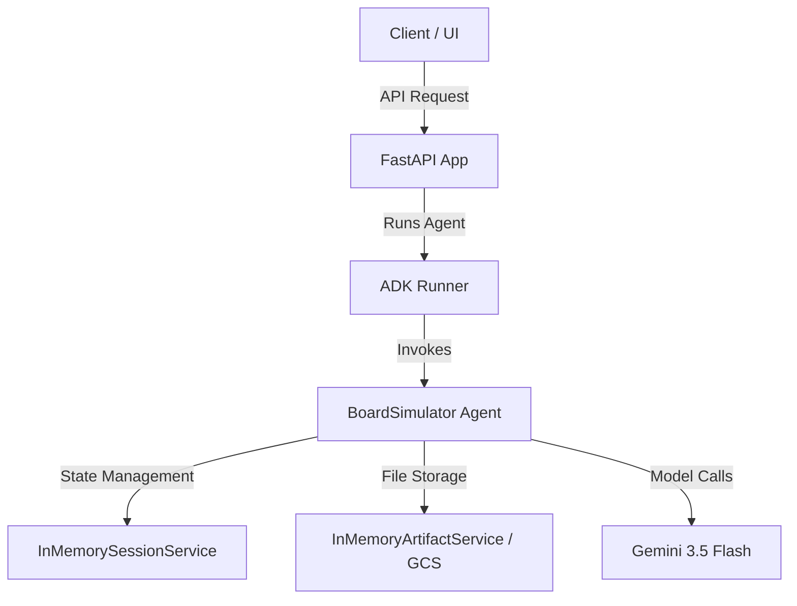
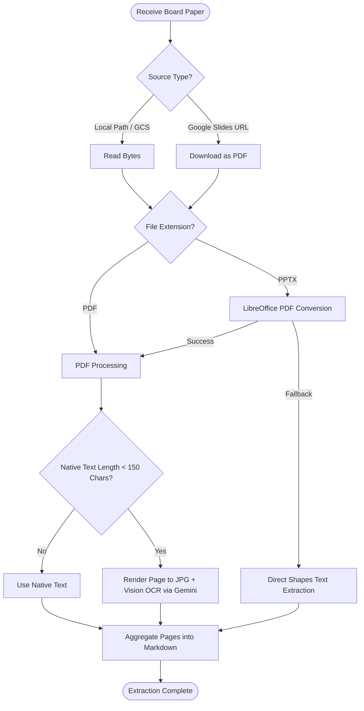
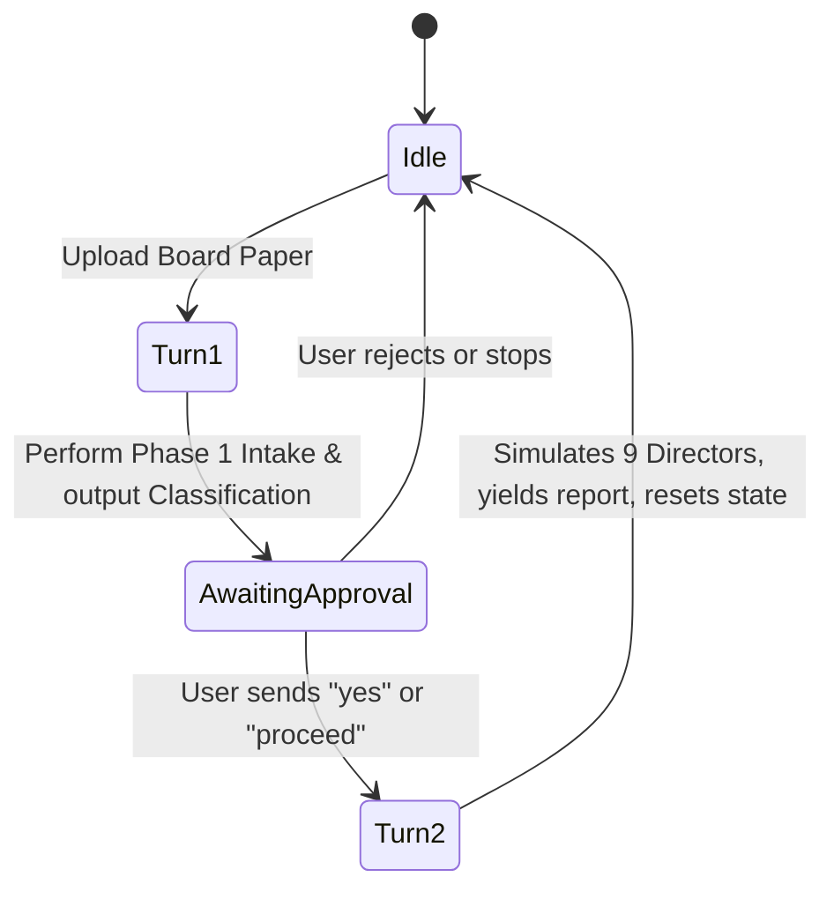

# Board Simulator — System Design Document

This document outlines the architecture, data pipeline, stateful multi-turn flow, and future enhancement paths for the **Woolworths Group Virtual Board Paper Reviewer** (Board Simulator) agent.

---

## 1. System Architecture

The Board Simulator is built using the **Google Agent Development Kit (ADK)** framework. It runs as a stateful, event-driven agent, exposed via a FastAPI web server.

### Core Components
- **`BoardSimulator` Agent (`app/agent.py`)**: Inherits from `BaseAgent`. Orchestrates the multi-turn review, parses board papers, launches parallel director simulations, and generates the final synthesis report.
- **FastAPI Integration (`app/fast_api_app.py`)**: Exposes the ADK agent via Server-Sent Events (SSE) `/run_sse` endpoints and exposes `/feedback` to collect structure telemetry.
- **Session & Artifact Services**: Logs and session data are stored in memory (`InMemorySessionService`) during local development and testing, and can utilize Google Cloud Storage (`GCS`) for artifacts.

---

## 2. Ingestion & Hybrid OCR Pipeline

To review board papers of varying visual formats (traditional PDFs, dense PowerPoint slides, etc.), the system implements a hybrid text extraction strategy.

### Hybrid OCR Highlights:
- **Low-Text Page Detection**: Pages with fewer than 150 native characters are treated as images (e.g., charts, diagrams, slide graphics).
- **Concurrency Management**: Uses an `asyncio.Semaphore` with a limit of **10** parallel vision OCR workers to prevent triggering Gemini API rate limits.
- **PPTX Fidelity**: Headless `LibreOffice` converts PowerPoint slides to high-resolution PDFs before rendering to ensure visual elements and layout structures are fully captured.

---

## 3. Stateful Multi-Turn Workflow

The simulation requires a strict confirmation step before executing the computationally expensive simulation of all 9 directors. This is implemented via stateful turns.

### State Transitions
- **`awaiting_approval`**: When `True`, the agent halts execution after Phase 1 and waits for user input.
- **`phase1_approved`**: Set to `True` when the user submits a positive response (`yes`, `proceed`, etc.), triggering Phase 2.

---

## 4. Simulation Phases & Execution

### Phase 1: Intake & Classification (Turn 1)
- **Prompting**: Analyzes paper content against specific categories and routing criteria.
- **Pydantic Validation**: Uses a Pydantic schema `Phase1Classification` mapped to Gemini's `response_schema` to enforce structured JSON output.
- **Chain-of-Thought Reasoning**: Instructs the model to output a detailed `reasoning` field describing its logical justification before selecting fields, improving classification and committee routing accuracy.

### Phase 2: Director Persona Simulation (Turn 2)
- **Parallel Roleplay**: Spawns concurrent execution tasks (`asyncio.gather`) for all 9 directors.
- **Real-Time Grounding**: Integrates Google Search tool queries for each director to retrieve live 2026 news, perspectives, and stances, falling back to a structured local database if the search fails.
- **Voice Discipline**: Constraints the output using `MemberSimulation` schema. Enforces strict numerical reference rules (e.g., Warwick Bray must query specific dollar values and basis point movements). The rationale MUST be written strictly in the third person using 'he', 'she', or 'they' (first-person references such as 'I' or 'my' are strictly forbidden).

### Phase 3 & 4: Synthesis & Recommendations (Turn 2)
- **Consolidation**: Gathers the outcomes of all simulated director responses and the raw board paper.
- **Vulnerabilities**: Analyzes critical vulnerabilities (e.g., trust deficit or governance failures) and rates the likelihood of approval.
- **Obvious Filter**: Applies a strict quality filter to recommendation output to exclude standard corporate behaviors (e.g., recommending to pre-brief the Chair).
- **Artifact Export**: Saves the final report to `app/artifacts/board_simulation_report.md`.

---

## 5. Potential Enhancements

We identify the following enhancement opportunities to further improve accuracy, latency, and features:

### A. Dynamic Committee Member Matching
*   **Current State**: All 9 directors are simulated for every proposal in Turn 2.
*   **Enhancement**: Map Phase 1 routed committees directly to their respective director members (e.g., if only routed to the *People Committee*, dynamically include only members of that committee in Phase 2). This reduces unnecessary API calls and latency.

### B. Persistent Session & State Storage
*   **Current State**: Uses an in-memory session manager (`session_service_uri = None`), meaning restarts wipe agent state.
*   **Enhancement**: Integrate a persistent storage database (e.g., PostgreSQL or Firestore) for ADK session service so simulations and states can be restored across restarts.

### C. Live Profile Scraping & Updates
*   **Current State**: Director baselines are parsed from a static PDF (`Detailed_Profiles_March_2026.pdf`).
*   **Enhancement**: Build a tool to scrape official Woolworths Group corporate governance portals to dynamically update director profiles, tenure, and committee roles in real-time.

### D. Multi-modal Board Paper Synthesis
*   **Current State**: Ingestion extracts text or OCR descriptions as Markdown before passing to the simulation prompt.
*   **Enhancement**: Directly send relevant paper/slide page image bytes along with the text during simulation steps, letting Gemini utilize its native multimodal vision capabilities to interpret charts and layout structures directly.

### E. Search Query Parallelization & Caching
*   **Current State**: Google Searches for directors are run sequentially or in parallel inside Turn 2.
*   **Enhancement**: Pre-fetch or cache grounding context for all directors once the paper is uploaded in Turn 1, significantly cutting down Phase 2 response latency.
